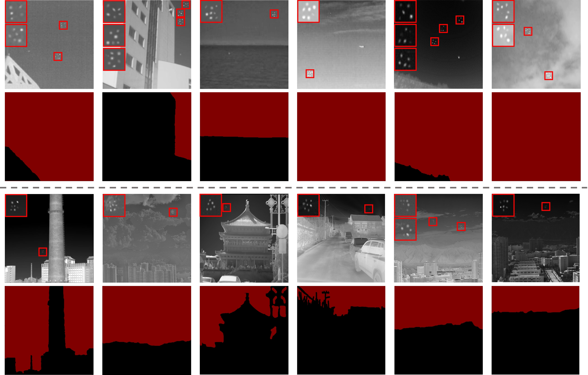
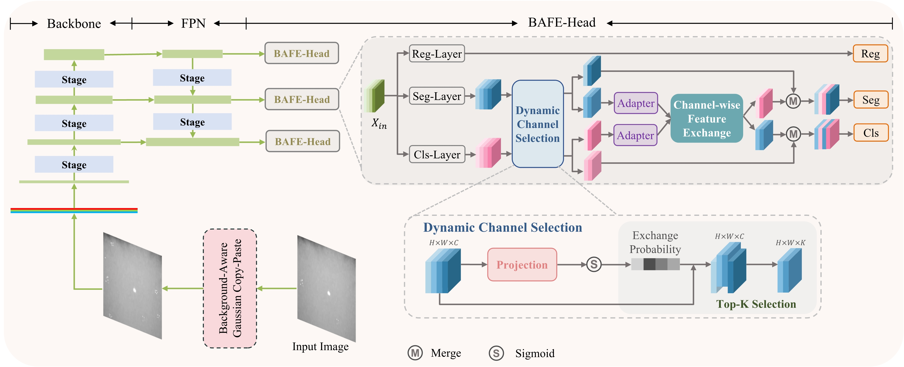

# Background Semantics Matter: Cross-Task Feature Exchange Network for Clustered Infrared Small Target Detection With Sky-Annotated Dataset

This repository is the official implementation of BAFE-Net

- [DenseSIRST](#densesirst)
    - [Model Zoo and Benchmark](#model-zoo-and-benchmark)
- [BAFE-Net](#bafenet)
    - [Installation](#installation)
        - [Step 1: Create a conda environment](#step-1-create-a-conda-environment)
        - [Step 2: Install PyTorch](#step-2-install-pytorch)
        - [Step 3: Install OpenMMLab Codebases](#step-3-install-openmmlab-codebases)
        - [Step 4: Install `deepir`](#step-4-install-deepir)
    - [Train](#train)
    - [Test](#test)


## DenseSIRST

### DenseSIRST Datasets: https://github.com/GrokCV/DenseSIRST



You can **download** our DenseSIRST dataset from [**Google Drive**](https://drive.google.com/uc?export=download&id=1PY0d1WuCjf_3wAIjDSNhYxREVK27OLzl).<br>

For both training and inference, the following dataset structure is required:

```angular2html
|- data
    |- SIRSTdevkit
        |-PNGImages
            |-Misc_1.png
            ......
        |-SIRST
            |-BBox
                |-Misc_1.xml
                ......
            |-BinaryMask
                |-Misc_1_pixels0.png
                |-Misc_1.xml
                ......
            |-PaletteMask
                |-Misc_1.png
                ......
            |-Point_label
                |-Misc_1_pixels0.txt
                ......
        |-SkySeg
            |-BinaryMask
                |-Misc_1_pixels0.png
                |-Misc_1.xml
                ......
            |-PaletteMask
                |-Misc_1.png
                ......
        |-Splits
            |-train_v2.txt
            |-test_v2.txt
            ......
```

- PNGImages is the folder for storing all images.
- SIRST and SkySeg are folders for storing annotation files.
    - SIRST corresponds to infrared small targets.
    - SkySeg corresponds to sky segmentation.

Please make sure that the path of your data set is consistent with the `data_root` in `configs/detection/_base_/datasets/sirst_det_seg_voc_skycp.py`


## Model Zoo and Benchmark

Checkpoint and Train log: [**Google Drive**](https://drive.google.com/uc?export=download&id=1li_WjUHAlO_2wOImO5yV16ISFDJc1LT5).<br>

### Leaderboard

| Method | Backbone | mAP<sub>07</sub>↑ | recall<sub>07</sub>↑ | mAP<sub>12</sub>↑ | recall<sub>12</sub>↑ | Flops↓ | Params↓ |
| - | - | - | - | - | - | - | - |
| **One-stage** | | | | | | | |            |
| SSD                 |          | 87.552G | 23.746M | 0.211 | 0.421 | 0.178 | 0.424 |
| RetinaNet           | ResNet50 | 52.203G | 36.330M | 0.114 | 0.510 | 0.086 | 0.523 |
| YOLOv3              |          | 50.002G | 61.949M | 0.233 | 0.424 | 0.207 | 0.413 |
| CenterNet           | ResNet50 | 50.278G | 32.111M | 0.138 | 0.316 | 0.124 | 0.317 |
| FCOS                | ResNet50 | 50.291G | 32.113M | 0.232 | 0.315 | 0.204 | 0.324 |
| ATSS                | ResNet50 | 51.504G | 32.113M | 0.248 | 0.327 | 0.202 | 0.326 |
| CentripetalNet      |          | 0.491T  | 0.206G  | 0.244 | 0.259 | 0.201 | 0.244 |
| AutoAssign          | ResNet50 | 50.555G | 36.244M | 0.255 | 0.354 | 0.180 | 0.314 |
| GFL                 | ResNet50 | 52.296G | 32.258M | 0.264 | 0.367 | 0.230 | 0.317 |
| PAA                 | ResNet50 | 51.504G | 32.113M | 0.255 | 0.545 | 0.228 | 0.551 |
| VFNet               | ResNet50 | 48.317G | 32.709M | 0.253 | 0.336 | 0.214 | 0.336 |
| PVT-T               |          | 41.623G | 21.325M | 0.109 | 0.481 | 0.093 | 0.501 |
| YOLOF               | ResNet50 | 25.076G | 42.339M | 0.091 | 0.009 | 0.002 | 0.009 |
| YOLOX               |          | 8.578G  | 8.968M  | 0.210 | 0.341 | 0.180 | 0.331 |
| TOOD                | ResNet50 | 50.456G | 32.018M | 0.256 | 0.355 | 0.226 | 0.342 |
| DyHead              | ResNet50 | 27.866G | 38.890M | 0.249 | 0.335 | 0.189 | 0.328 |
| DDOD                | ResNet50 | 46.514G | 32.378M | 0.253 | 0.335 | 0.230 | 0.351 |
| RTMDet              |          | 51.278G | 52.316M | 0.229 | 0.349 | 0.212 | 0.350 |
| EfficientDet        |          | 34.686G | 18.320M | 0.146 | 0.464 | 0.094 | 0.517 |
| **Two-stage** | | | | | | | |
| Faster R-CNN        | ResNet50 | 0.759T  | 33.035M | 0.091 | 0.022 | 0.015 | 0.029 |
| Cascade R-CNN       | ResNet50 | 90.978G | 69.152M | 0.136 | 0.188 | 0.139 | 0.194 |
| Grid R-CNN          | ResNet50 | 0.177T  | 64.467M | 0.156 | 0.122 | 0.104 | 0.190 |
| Libra R-CNN         | ResNet50 | 63.990G | 41.611M | 0.141 | 0.142 | 0.085 | 0.120 |
| TridentNet          | ResNet50 | 0.759T  | 33.035M | 0.091 | 0.009 | 0.014 | 0.021 |
| SABL                | ResNet50 | 0.125T  | 42.213M | 0.124 | 0.104 | 0.104 | 0.171 |
| Dynamic R-CNN       | ResNet50 | 63.179G | 41.348M | 0.184 | 0.235 | 0.111 | 0.190 |
| **End2End** | | | | | | | |
| DETR                | ResNet50 | 24.940G | 41.555M | 0.000 | 0.000 | 0.000 | 0.000 |
| Sparse R-CNN        | ResNet50 | 45.274G | 0.106G  | 0.183 | 0.572 | 0.154 | 0.614 |
| Deformable DETR     | ResNet50 | 51.772G | 40.099M | 0.024 | 0.016 | 0.018 | 0.197 |
| Conditional DETR    | ResNet50 | 27.143G | 40.297M | 0.000 | 0.000 | 0.000 | 0.001 |
| DAB-DETR            | ResNet50 | 28.939G | 43.702M | 0.005 | 0.054 | 0.000 | 0.001 |
| **BAFE-Net (Ours)** | ResNet18 | 57.654G | 22.31M  | **0.283** | 0.335 | 0.233 | 0.325 |
| **BAFE-Net (Ours)** | ResNet50 | 71.639G | 35.626M | 0.274 | 0.342 | **0.248** | 0.338 |


## BAFE-Net



### Installation

Step 1: Create a conda environment

```shell
$ conda create --name deepir python=3.9
$ conda activate deepir
```

Step 2: Install PyTorch

```shell
$ conda install pytorch torchvision torchaudio pytorch-cuda=11.8 -c pytorch -c nvidia
```

Step 3: Install OpenMMLab Codebases

```shell
pip install -U openmim
mim install mmengine
mim install "mmcv>=2.0.0"
mim install "mmdet>=3.0.0"
pip install "mmsegmentation>=1.0.0"
pip install dadaptation
```

Step 4: Install `deepir`

```shell
$ python setup.py develop
```

**Note**: make sure you have `cd` to the root directory of `deepinfrared`

```shell
$ git clone git@github.com:GrokCV/BAFE-Net.git
$ cd BAFE-Net
```


### Train

```shell
$ CUDA_VISIBLE_DEVICES=0 python train.py <CONFIG_FILE>
```

For example:

```shell
$ CUDA_VISIBLE_DEVICES=0 python tools/train_det.py configs/detection/fcos_changer_seg/fcos_changer_seg_r50-caffe_fpn_gn-head_1x_densesirst.py
```

### Test

```shell
$ CUDA_VISIBLE_DEVICES=0 python test.py <CONFIG_FILE> <SEG_CHECKPOINT_FILE>
```

For example:

```shell
$ CUDA_VISIBLE_DEVICES=0 python tools/test_det.py configs/detection/fcos_changer_seg/fcos_changer_seg_r50-caffe_fpn_gn-head_1x_densesirst.py work_dirs/fcos_changer_seg_r50-caffe_fpn_gn-head_1x_densesirst/20240719_162542/best_pascal_voc_mAP_epoch_8.pth
```

If you want to visualize the result, you only add ```--show``` at the end of the above command.

The default image save path is under <SEG_CHECKPOINT_FILE>. You can use `--work-dir` to specify the test log path, and the image save path is under this path by default. Of course, you can also use `--show-dir` to specify the image save path.

